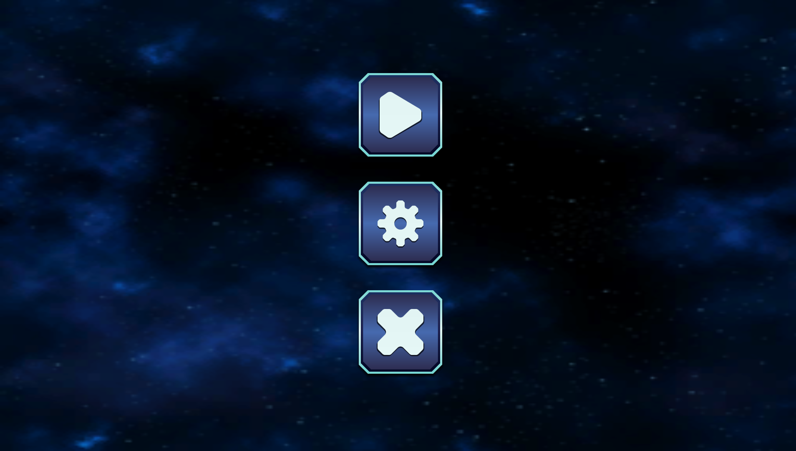
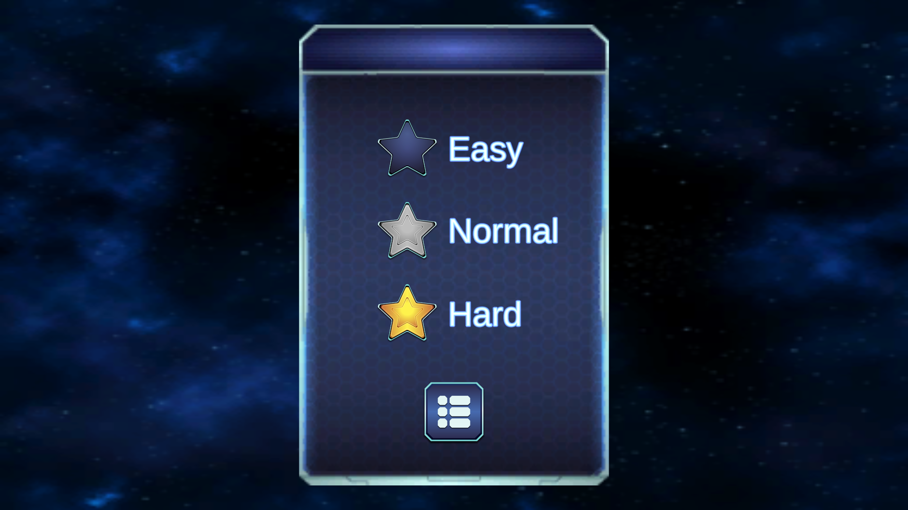
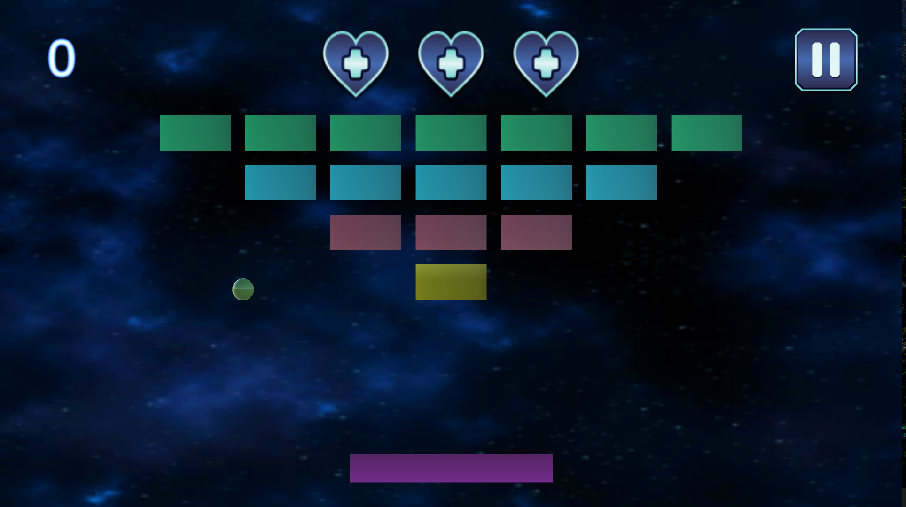
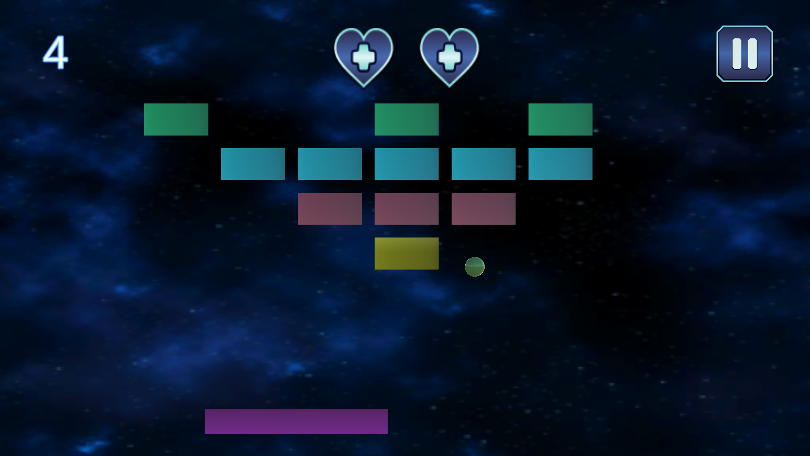

# Arkanoid

**Тестовое задание для QwertyLiberty**  

## Техническое задание:

* Сеттинг: 3D аркада в стиле ARKANOID
* Количество уровней: 1 уровень, количество кирпичиков - 15шт.,выстроены в виде перевернутой пирамиды
* Начальное меню start/options/exit
* В «options» сделать возможность выбора сложности: easy, normal, hard (отличие - скорость передвижения шарика,длинна площадки), реализация возврата в главное меню
* В игре должен присутствовать работающий счетчик очко в и 3 жизни
* После лишения всех жизней перенос на отдельный экран со следующей информацией:
  1. надпись «you lose»
  2. количество заработанных очков
  3. значек переиграть
  4. возможность посмотреть рекламу, чтобы продолжить играть с дополнительной жизнью, после просмотра возвращает игрока в игру с сохраненным прогрессом 
  (при нажатии реализовать переход по ссылке: https://www.youtube.com/watch?v=fdyuOiciwB4)
  5. выход в главное меню
* После выигрыша экран со следующей информацией
  1. надпись «you win»
  2. количество заработанных очков
  3. значек «переиграть»
  4. значек «следующий уровень» (после нажатия кидаем игрока на тот же 1 и единственный уровень, но с заработанными очками)
  5. выход в главное меню
* В игре должны быть звуки: переключения в меню, нажатие на кнопки в меню, звук удара шарика о кирпичики о платформу, звук разрушения платформы
* В игре должна быть реализова на пауза

## Примечание:
графика не принципиальна, главное, чтобы работали все логики, описанные в тз

## Демонстрация:
Стартовое меню 
  

  

Выбор уровня 
  

  

Начало игрового процесса
  

  

Продолжение игрового процесса
  

  

